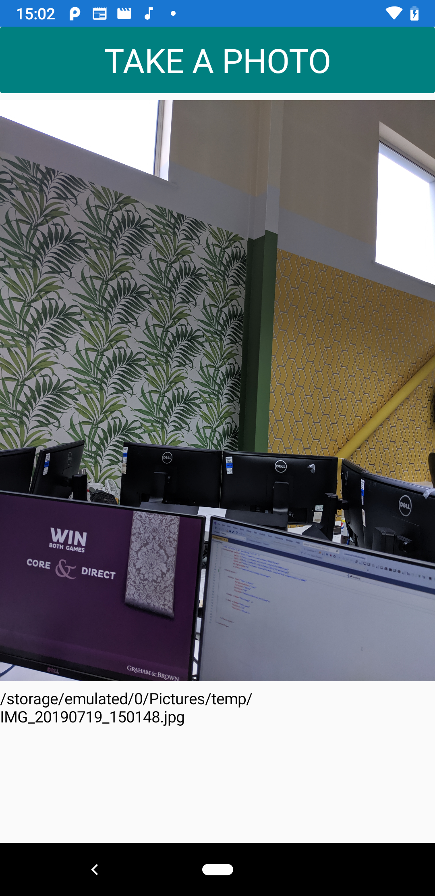

# PhotoApp
App to take a picture and display it using Xamarin Forms. This application is cross plaform (iOS & Android) compatible

I used the cross platform media plugin for the camera functionality:  
https://github.com/jamesmontemagno/MediaPlugin

# Screenshot

